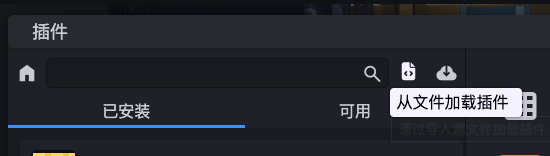
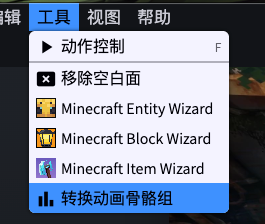
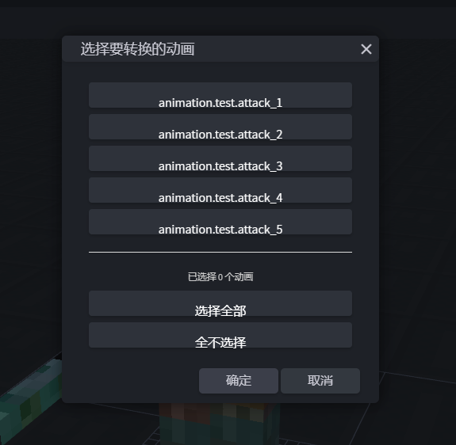
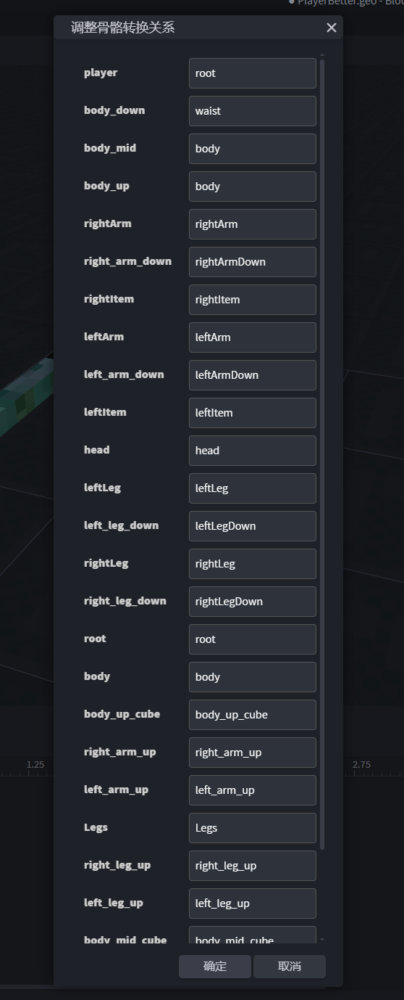
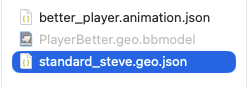
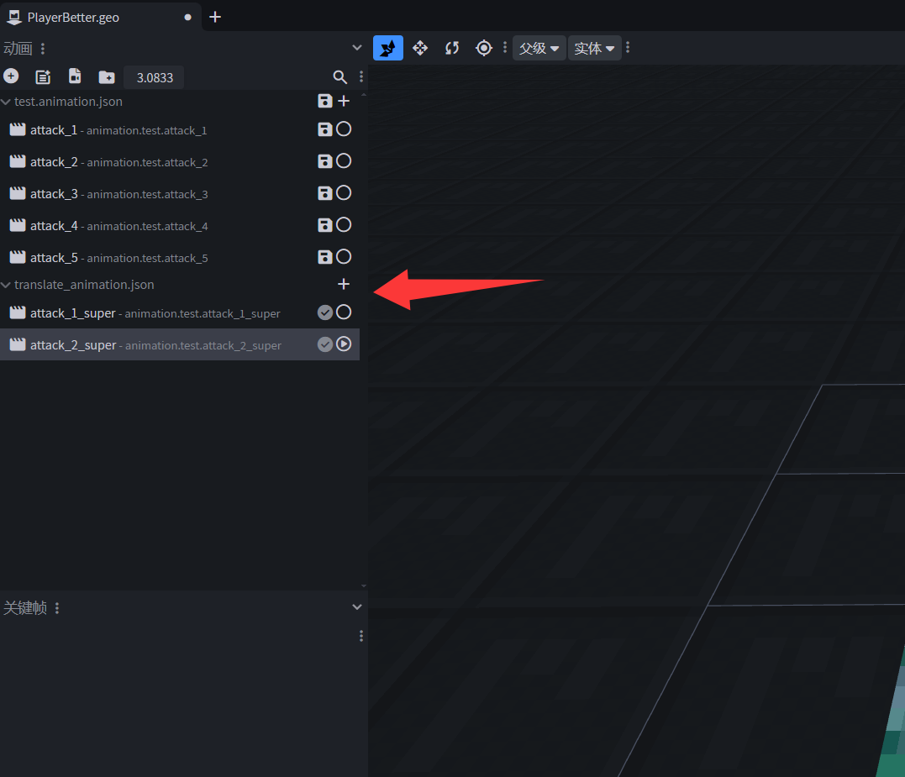

# 多关节骨骼转换插件

## 介绍

多关节骨骼转换插件是服务于网易基岩版动作优化骨骼转换的Blockbench插件。

`animate_bone.js`文件是该插件的核心文件，可在项目仓库进行下载。

## 使用方法

### 一、导入插件

1. 点击从本地导入插件，选择已下载的`animate_bone.js`插件脚本并导入。导入成功即完成插件的启用。

   

2. 导入成功后即可在顶部“工具”中看到“转换动画骨骼组”按钮

   

### 二、配置插件选项

1. 启用插件后，工具栏新增“转换动画骨骼组”选项。单击该选项打开插件菜单界面，选择需要统一转换的动画。

2. 选择完毕后，点击“确定”，进行“配置动画骨骼关系映射”步骤，可根据自己模型的骨骼来调整映射关系

   

3. 映射关系调整完毕后，点击“确认”，进行“骨骼参考文件”选择。由于两个模型的骨骼枢轴点不同，需要目标模型骨骼枢轴信息来完成旋转偏移计算。该步骤不可跳过且必须选择有效的基岩版geo模型文件。 

   > 官方骨骼参考文件可点击此链接下载 [下载骨骼参考文件](https://g79.gdl.netease.com/official_steve_model.zip)

   

4. 完成转换后，自动输出`translate_animation`文件到当前项目的“动画”中

   
